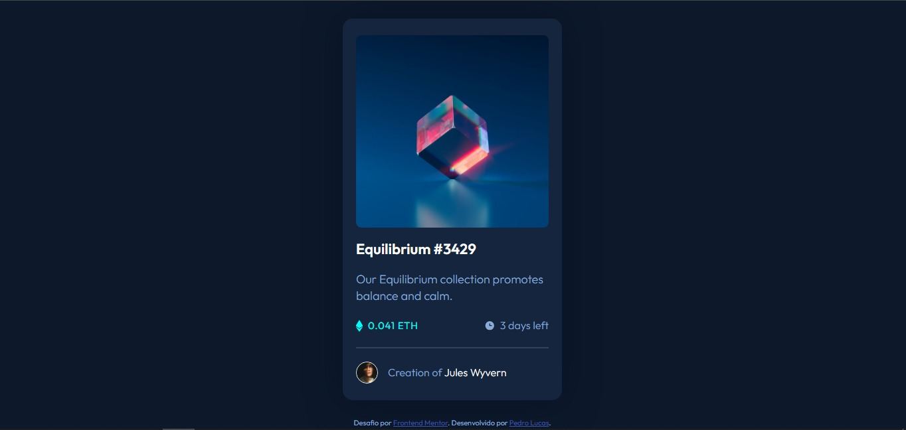
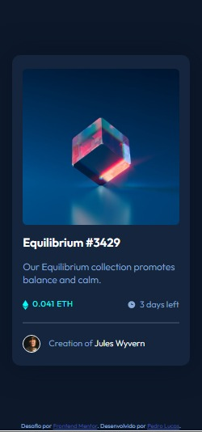

# Frontend Mentor - NFT preview card component solution

Essa é uma solução para o [Desafio NFT preview card component no Frontend Mentor](https://www.frontendmentor.io/challenges/bento-grid-RMydElrlOj). 

## Sumário dos conteúdos

- [Visão geral](#visão-geral)
  - [O desafio](#o-desafio)
  - [Screenshot](#screenshot)
  - [Link](#link)
- [Meu processo](#meu-processo)
  - [Resursos utilizados](#recursos-utilizados)
- [Reconhecimentos](#reconhecimentos)

## Visão Geral

### O desafio

Os usuários devem ser capazes de:

- Visualizar o layout ideal para a interface dependendo do tamanho da tela do seu dispositivo
- Desenvolver efeitos de passagem de mouse por cima de elementos interativos

### Screenshot

#### Versão desktop

#### Versão mobile

### Link

- URL da solução: [Frontend Mentor | NFT preview card component](https://shyayhs.github.io/frontend-mentor-nft-preview-card-component/)

## Meu processo

### Recursos utilizados

- Marcação semântica HTML5
- Propriedades personalizadas CSS

## Autor

- Linkedin - [Pedro Lucas](www.linkedin.com/in/pedro-lucas-rocha)
- Frontend Mentor - [@Shyayhs](https://www.frontendmentor.io/profile/Shyayhs)
- Github - [@Shyayhs](https://github.com/Shyayhs)

## Reconhecimentos

Agradecimento aos gêmeos do curso DevQuest que me auxiliaram no desenvolvimento da resolução.